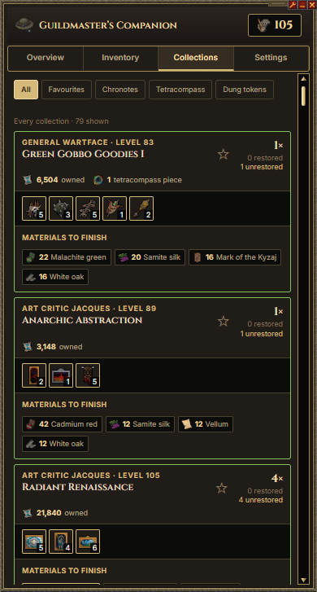
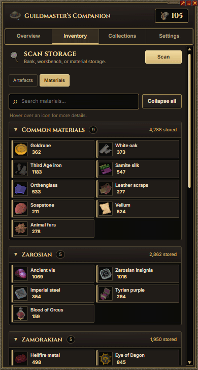
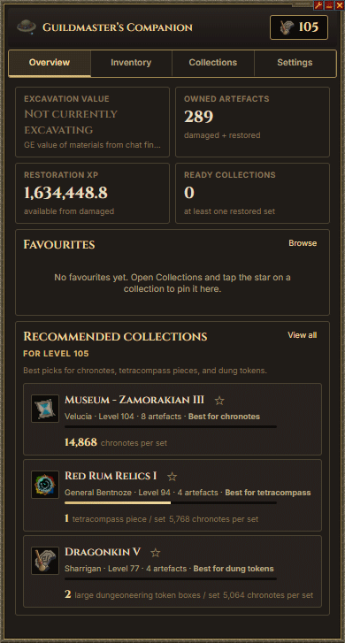

# Guildmaster’s Companion

An Alt1 Toolkit app for RuneScape 3 Archaeology. Scan your storage, track artefacts and materials, watch excavation value while you dig, and see what collections you can finish with what’s already banked.

**Live:** https://plusdivide.github.io/guildmasters-companion-alt1/

**[Add to Alt1](https://plusdivide.github.io/guildmasters-companion-alt1/add.html)** — opens the installer in Alt1 Toolkit.

## Features

- **Scan storage** — bank, material storage, and Archaeology workbench, so the app knows what you own
- **Track artefacts & materials** — damaged and restored artefacts plus dig materials in one place, easy to see what you have
- **Live excavation gp/h** — accurate Grand Exchange value per hour from finds while you dig
- **Restore costs** — materials (and GE value) needed to restore artefacts for collections
- **Collection rewards** — chronotes, tetracompass pieces, and other rewards from sets you can complete with what’s banked

## Screenshots

<p align="center">
  
  
  
</p>

<p align="center">
  <em>Overview · Inventory · Collections</em>
</p>

## Permissions

Grant **View screen** (scans) and **Get game state** (mouse for teach + chat watching) in the app spanner → permissions.

## Run locally

```powershell
npm install
npm run dev
```

Open `http://127.0.0.1:5173`, or in Alt1:

```text
alt1://browser/http://127.0.0.1:5173
```

## Data refresh (maintainers)

```powershell
npm run sync-data
npm run sync-sprites
npm run build-sprites
npm run build-framed-sprites
```

Assumes RuneScape at **100% interface scale**.

Designed by RuneScape user **Husafell** — PM for requests and feedback.
